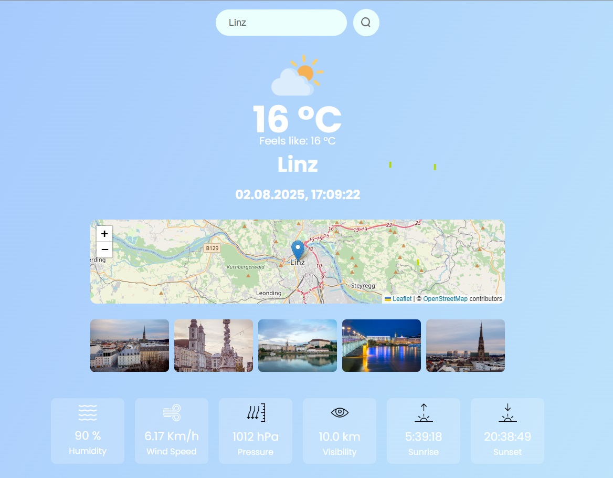

🌤️ Weather App

This is a simple weather application built with **React** using **Vite** and the **OpenWeatherMap API**.  
It allows users to search for a city and get current weather details, including temperature, wind speed, humidity, sunrise/sunset time, and more.

---

🚀 Features

- City-based weather search
- Real-time weather data fetching
- Custom weather icons based on condition
- Displays:
  - Temperature
  - Feels like
  - Wind speed
  - Humidity
  - Pressure
  - Visibility
  - Sunrise & Sunset
  - Local time (formatted as DD.MM.YYYY)

---

🔧 Technologies Used

- [React](https://reactjs.org/)
- [Vite](https://vitejs.dev/)
- [OpenWeatherMap API](https://openweathermap.org/api)
- CSS for styling

---

🖼️ Screenshot

Below is a screenshot of the Weather App showcasing its interface:



---

⚙️ Setup

1. Get OpenWeatherMap API Key
   To use this weather app, you'll need an API key from OpenWeatherMap:

   1. Go to [OpenWeatherMap API](https://openweathermap.org/api).
   2. Create an account and log in.
   3. After logging in, navigate to the **My API keys** section.
   4. Generate a new API key or use an existing one.

2. Create a `.env` File
   In the root of your project, create a `.env` file and add your API key like this:

   VITE_APP_ID=your_openweathermap_api_key_here

   Replace your_openweathermap_api_key_here with the API key you obtained from OpenWeatherMap.

3. Ignore .env File in Git
   To prevent the API key from being uploaded to GitHub, make sure to add .env to your .gitignore file:
   .env

📦 Installation

    ```bash
    git clone https://github.com/yourusername/weather.git
    cd weather
    npm install

⚙️ Run the App

    npm run dev
    Open http://localhost:5173 to view it in the browser.
